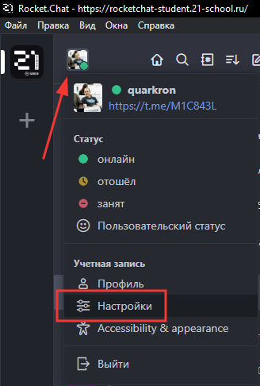
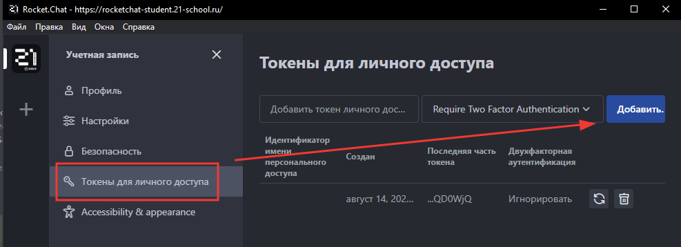
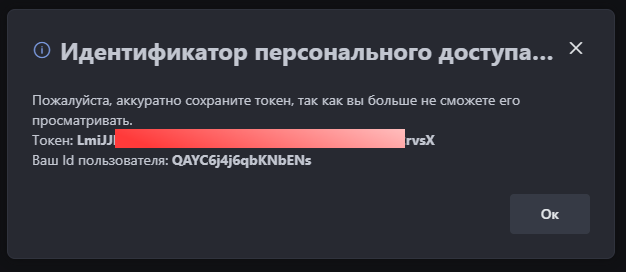
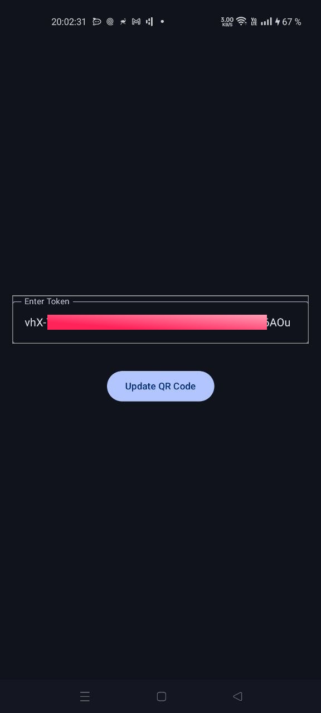
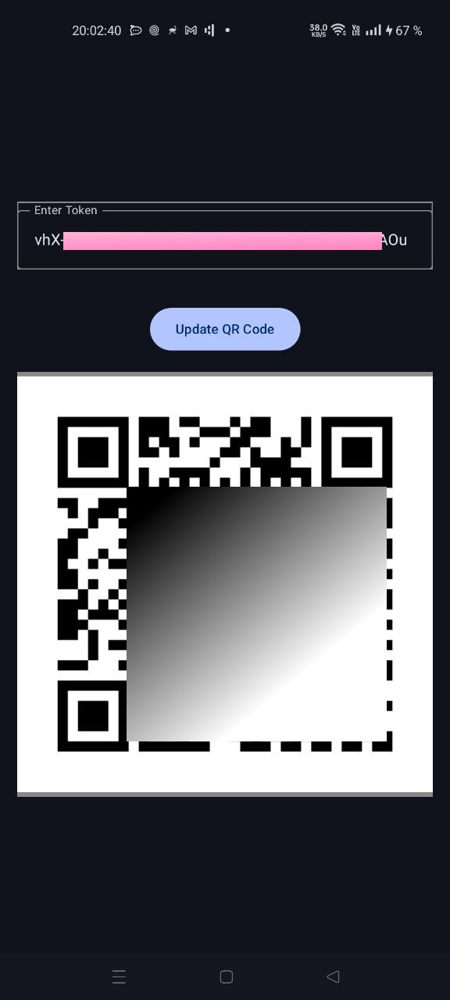

# School21 RocketChat QR-code Android App

Приложение для андроид с помощью которого можно удобно получать qr-код для входа в кампус

1. Необходимо сгенерировать токен авторизации в рокетчате 

2. Переходим в раздел "Токены для личного доступа" и нажимаем "Добавить" 

3. В появившемся окне копируем токен авторизации 

4. Копируем полученный токен в поле ввода приложения и нажимаем кнопку получить qr-код

